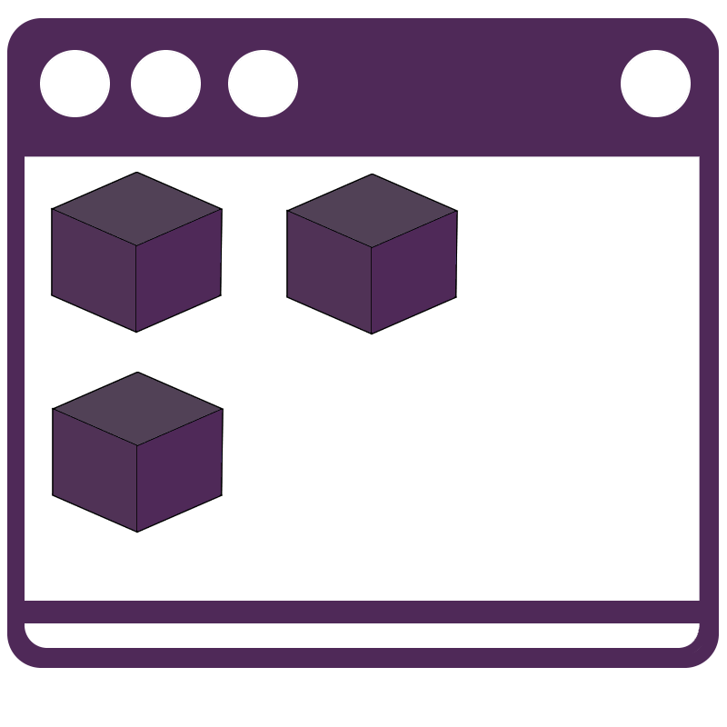

# 

Conan App-Launcher
=====================

Quick Overview
--------------

The goal of this project is to provide a frontend of execuatble package with the package manager conan.

Toolchain
---------

This project uses Python with Qt as a frontend using the PyQt integration.
The IDE integration is done for VsCode and the automation is written for Linux.
