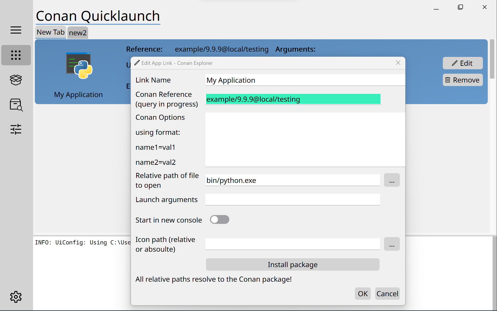

# 

# Conan App-Launcher

TODO : Test Badge 

## Quick Overview

The goal of this project is to provide a frontend to start executable contained in packages of the package manager conan. It is intented to be used on Windows and Linux x64 platforms.

# 

Features:
- configurable layout (tabs and applications) with json file
- installs all referenced packages automatically
- automatic settings resolution for your platform
- integrated console for information an packages and config file
- installable with pip (soon from pypi)

## How to install?

### From source

After checkout use the command:
`pip install .`

Call the executable with: 
`conan_app_launcher -f <config_file_path>`, if the Python "scripts" folder is on your system path.

### With pip from Pypi
Coming soon

## Config File

The config file uses the following exemplary schema:

    {
        "version": "0.1.0",
        "tabs": [
            {
                "name": "Basics",
                "apps": [
                    {
                        "name": "App1 with spaces", 
                        "package_id": "app1/0.1.0@user1/stable", // full conan reference
                        "executable": "bin/app1", // relative to conan "package folder"
                        "icon": "MyIcon.png" // relative to this config file
                    },
                    {
                        "name": "App2",
                        "package_id": "app2/0.2.0@user2/testing",
                        "executable": "bin/app2", // forward slashes are preferred
                        "icon": "C:\\CustomIcon.ico" // but escaped backslashes also work
                    }
                ]
            },
            {
                "name": "Extra",
                "apps": [
                    {
                        "name": "App3",
                        "package_id": "app3/0.3.0@user3/stable",
                        "executable": "bin/app3", // extension (.exe) can be ommited for windows
                        // Icon can be ommitted
                    }
                ]
            }
        ]
    }

## Toolchain

This project uses Python with Qt as a frontend using the PyQt integration.
The IDE integration is done for VsCode.
